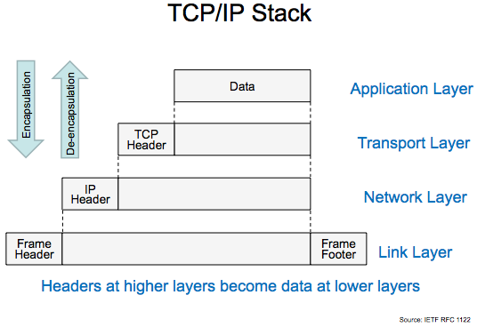

# Network Engineering Run-Down

## Objectives

*By the end of this lesson, students will be able to:*

## Pre-Requisites

*Before this lesson, students should be able to:*

- **Explain** how sharks are detrimental to the health of the Internet
- **Describe** how the Internet works better than Al Gore
- **Understand** that 0s and 1s are better than other numbers

## Network Addresses

## Network Maps

## Network Layers

As discussed earlier in the course, network signals are nothing more than an incredibly rapid sequence of `on/off/on/on/off...` which can be reducted to a binary representation of `10110...`.  Let's break down what those `0s` and `1s` are actually saying...

What's happening in this picture?  Well, much like Russian nesting dolls, we have a nugget of information that we want to transmit from Computer A to B.  But this information is a stream of `0s` and `1s` that mean nothing out of context.

In order for our package to get to Computer B, and to actually run code on the other side, we need three things:

1. A network (IP) address to get our package from Computer A's building/network to Computer B's building/network over and incredibly interconnected network of routers, switches, cables, and sharks.
2. A local (MAC) address to get our package out of Computer A's building/network and to get to Computer B once it is inside Computer B's building/network.
3. A TCP port like HTTP (80) or HTTPS (443) so Computer B knows how to run the instructions coming from Computer A.
  1. For instance, `please send back your index.html and all your front-end resources so I can load your page`

When the package gets to Computer B's building, we rip open doll number one.

When the package gets to Computer B, we rip open doll number two.

When the package arrives at the correct port inside Computer B, we execute the code inside that final doll.  `011101001111000101011...`

## Network Hardware
