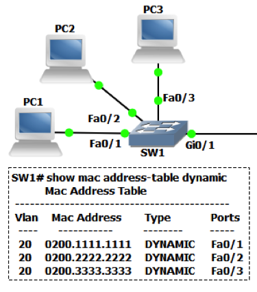
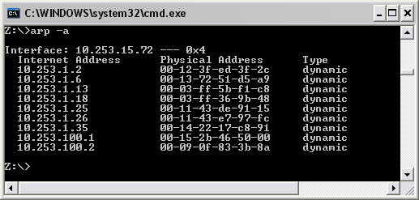
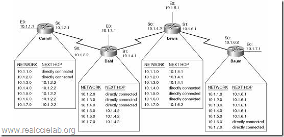
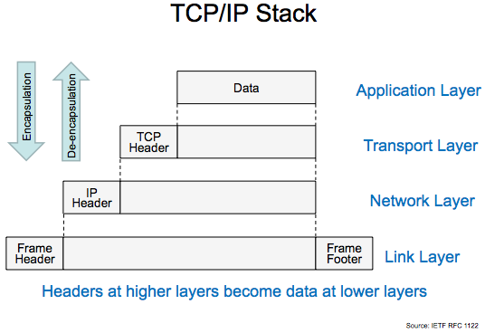
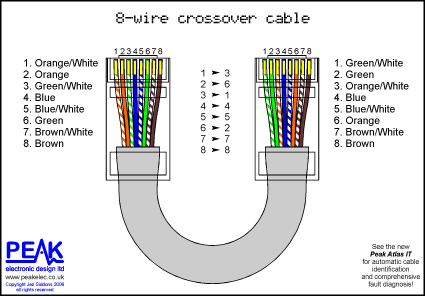
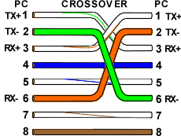
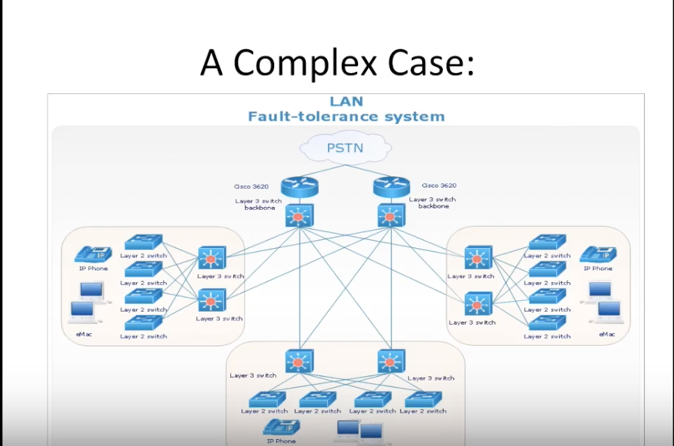

# Network Engineering Run-Down

## Objectives

*By the end of this lesson, students will be able to:*

## Pre-Requisites

*Before this lesson, students should be able to:*

- **Explain** how sharks are detrimental to the health of the Internet
- **Describe** how the Internet works better than Al Gore
- **Understand** that 0s and 1s are better than other numbers

## Network Addresses

<!--Draw up envelope with MAC Address, IP Address, Port -->

The three most important parts of every address are:

1. The MAC Address, also known as a Layer 2 address, or a link-local address
    - The MAC Address gets you from point A to point B *within* a network
2. The IP Address, also known as a Layer 3 address, or a network address
    - The IP Address gets you from point A to point B *between* networks
3. The Port, also known as a Layer 4 address
    - The Port gets you from point A to point B *within a computer*

### Independent Practice

First, find your MAC Address.

1. Click the apple icon in the top left of your screen, and select `About This Mac`
2. Select `System Report...`
3. At the bottom, you should see `Hardware UUID`.  This is your MAC address.
4. Quickly memorize your MAC address...jk, let's move on to your IP address

Your IP Address is *almost always* assigned by another device, for instance, the WiFi access point in the rafters.

1. Open Terminal
2. Enter the command `ifconfig`
3. Scroll the results until you see an address like `10.62.xx.xx`, that's your IP address.
4. You will probably see two address that start with `10.62`.  The other address, the one that ends in `255` is the broadcast address.  As its name implies, that is the address you would use to send a message to everyone on your network.

### PANIC!!

An IP address consists of 4 octets, i.e. 4 sets of 8 binary digits, i.e. 4 bytes.

If you do some "quick" math in your head, you can see that means our IP address space is painfully limited.

`2^8*2^8*2^8*2^8 = 256*256*256*256 ≈ 4.3 billion address possibilities`

WHAT?! But there are almost 7.5 billion people on Earth.  We're going to run out of addresses!  This panic you are feeling was very real 15 years ago, but some smart people came up with two solutions that have abated the impending IPocalypse.

1. Private IP addresses
    - You're probably used to seeing `192` at the front of your IP address on your computer.  That's because these numbers are in the "private IP range", meaning they will not route over the Internet.  Precisely because they can't be reached from other networks, we can use these IP addresses over and over again in different places.  That way, you can be `192.168.1.4` at home and at work, and we can save another IP address.  Bullet dodged!

2. IPv6
    - Alright, cool, that delays the IPocalypse a bit, but it's still coming.  With that in mind, some smart people devised [IPv6](https://en.wikipedia.org/wiki/IPv6) which added some cool features, most importantly 128-bit address.  That's **4 times as long** as the IPv4 addresses we just mentioned.  This allows about `3.4*10^38` addresses.  In other words, we're good for a while.  IPv6 is gaining a lot of traction, and almost all modern devices run IPv4 and IPv6 *in parallel*, so when we reach that day when we really do run out of IP addresses, we can switch over.  **Spoiler alert: [it is already happening.](https://www.wired.com/2015/09/north-america-just-ran-old-school-internet-addresses/)**

So a whole bunch of `0s` and `1s` get transmitted through wires or the air, but how does the traffic get redirected to its destination?

Tables.  Lots of tables.

### MAC Tables

MAC tables are held on "Layer 2 devices" like switches.  They map MAC addresses to ports or wifi repeaters/receivers.  Like this:

### ARP Tables

ARP Tables are used for conversion from IP address to MAC address and vice versa.  I.e. "I know this should be going to 192.168.1.4, but what is the MAC address on it?"  Once we know the MAC address, we can use a MAC table to find which direction to send our data to get to its destination.

### Routing Tables

Routing tables are held on "Layer 3 devices" like routers.  They map IP networks to ports, so a router knows which way to forward traffic to certain networks.  Routing tables are designed to be incredibly dynamic and redundant.  Telecom building loses power in Detroit?  Not a problem, after a few unsuccessful attempts of sending traffic through Detroit, we'll try Chicago.  And we're up and rocking again.

### Independent Practice

Take a minute to look at your routing table for your laptop.

To print out this table, run the command `netstat -nr`.

If you look to the right, you will probably notice two values in the column that repeat a lot.

1. `lo0` is your **loopback port**.  In other words, it directs traffic *within your computer*.
2. The port you saw next to your IP address when you ran `ifconfig`, most likely `en0`.  This is the way almost all traffic leaves and enters your computer.

## Network Layers

As discussed earlier in the course, network signals are nothing more than an incredibly rapid sequence of `on/off/on/on/off...` which can be reducted to a binary representation of `10110...`.  Let's break down what those `0s` and `1s` are actually saying...

What's happening in this picture?  Well, much like Russian nesting dolls, we have a nugget of information that we want to transmit from Computer A to B.  But this information is a stream of `0s` and `1s` that mean nothing out of context.

In order for our package to get to Computer B, and to actually run code on the other side, we need three things:

1. A network (IP) address to get our package from Computer A's building/network to Computer B's building/network over and incredibly interconnected network of routers, switches, cables, and sharks.
2. A local (MAC) address to get our package out of Computer A's building/network and to get to Computer B once it is inside Computer B's building/network.
3. A TCP port like HTTP (80) or HTTPS (443) so Computer B knows how to run the instructions coming from Computer A.
    - For instance, `please send back your index.html and all your front-end resources so I can load your page`

When the package gets to Computer B's building, we rip open doll number one.

When the package gets to Computer B, we rip open doll number two.

When the package arrives at the correct port inside Computer B, we execute the code inside that final doll.  `011101001111000101011...`

<!--Catch phrase with IP address, MAC address, port -->

## Network Hardware

### Anatomy of an Ethernet cable

Your average `cat5e` cable contains eight wires.  In order to facilitate non-stop conversation between the two ends of the cable (two computers, for instance), these wires are "crossed over" so that the output of one computer goes directly to the input of the other computer.  That looks like this:

### Network Maps

OK, let's put all that together.  What does it look like when we create all the connections we need to share data with the world?  Below is a very small piece of the giant map of the Internet and all its devices:

Zoom out a bit, and here's the 10,000 foot view of that giant map:

